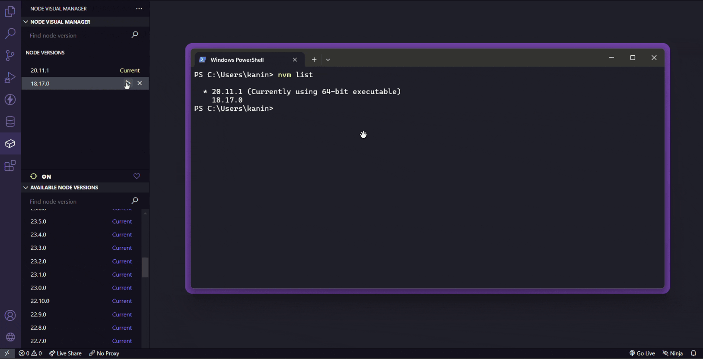
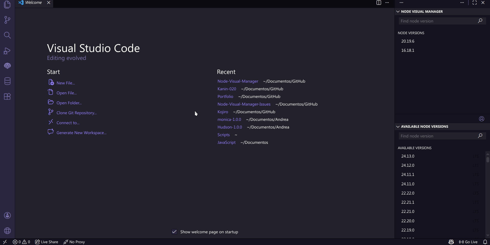

# NVM - Node Visual Manager

[](LICENSE)
[](https://code.visualstudio.com/)
[](https://marketplace.visualstudio.com/items?itemName=kanin-020.node-visual-manager)

A VS Code extension that brings NVM (Node Version Manager) directly into the editor — install, switch, and manage Node.js versions without leaving VS Code.

> **Note:** This extension does not install NVM itself. It works as a wrapper around an existing NVM installation.

## Features

- View and switch between installed Node.js versions
- Install new versions (Current, LTS, Old Stable, Old Unstable)
- Install from source (Linux/macOS)
- Uninstall versions
- Enable/disable NVM (Windows only)
- Automatic `.nvmrc` detection per workspace
- Search and filter versions in the sidebar

## Preview

### Windows



### Linux



## Requirements

### Windows

Install [nvm-windows](https://github.com/coreybutler/nvm-windows/releases) (v2.0.0+).

### Linux / macOS

Install [nvm](https://github.com/nvm-sh/nvm#installing-and-updating) (NVM SH).

## Installation

### From VS Code Marketplace

1. Open VS Code
2. Go to Extensions (`Ctrl+Shift+X`)
3. Search for "NVM - Node Visual Manager"
4. Click **Install**

### From VSIX

1. Download the `.vsix` file from [Releases](https://github.com/Kanin-020/Node-Visual-Manager-Issues/releases)
2. Open VS Code
3. Run `Extensions: Install from VSIX...` from the Command Palette
4. Select the downloaded `.vsix` file

## Usage

1. Open the **Node Visual Manager** panel in the activity bar (left side)
2. **Installed Node Versions** — View, switch, or uninstall your local versions
3. **Available Node Versions** — Browse and install versions from the remote repository

The extension automatically activates the version specified in `.nvmrc` when you open a workspace.

## Platform Support

| Feature              | Windows | Linux | macOS |
| -------------------- | ------- | ----- | ----- |
| Install versions     | ✅      | ✅    | ✅    |
| Uninstall versions   | ✅      | ✅    | ✅    |
| Switch versions      | ✅      | ✅    | ✅    |
| Enable/Disable NVM   | ✅      | ❌    | ❌    |
| Install from source  | ❌      | ✅    | ✅    |
| Auto .nvmrc detect   | ✅      | ✅    | ✅    |

## Development

### Prerequisites

- [Node.js](https://nodejs.org/) (v18+)
- [VS Code](https://code.visualstudio.com/)

### Setup

```bash
# Clone the repository
git clone https://github.com/Kanin-020/Node-Visual-Manager-Issues.git
cd Node-Visual-Manager-Issues

# Install dependencies
npm install

# Compile the extension
npm run compile
```

### Run & Debug

1. Open the project in VS Code
2. Press `F5` to launch the Extension Development Host

### Scripts

| Command              | Description                                  |
| -------------------- | -------------------------------------------- |
| `npm run compile`    | Compile the extension                        |
| `npm run watch`      | Watch for changes and recompile              |
| `npm run package`    | Build production bundle and package as `.vsix` |
| `npm run lint`       | Run ESLint                                   |
| `npm run lint:fix`   | Run ESLint with auto-fix                     |
| `npm run format`     | Format code with Prettier                    |
| `npm run format:check` | Check formatting without writing           |
| `npm test`           | Run tests                                    |
| `npm run clean`      | Remove dist, out, and `.vsix` files          |

## Contributing

Contributions are welcome! Please feel free to submit a [Pull Request](https://github.com/Kanin-020/Node-Visual-Manager-Issues/pulls).

1. Fork the repository
2. Create your feature branch (`git checkout -b feature/amazing-feature`)
3. Commit your changes (`git commit -m 'Add amazing feature'`)
4. Push to the branch (`git push origin feature/amazing-feature`)
5. Open a Pull Request

## License

This project is licensed under the Apache License 2.0 — see the [LICENSE](LICENSE) file for details.

## Author

**Jesús Álvarez (Kanin)** — [GitHub](https://github.com/Kanin-020)
